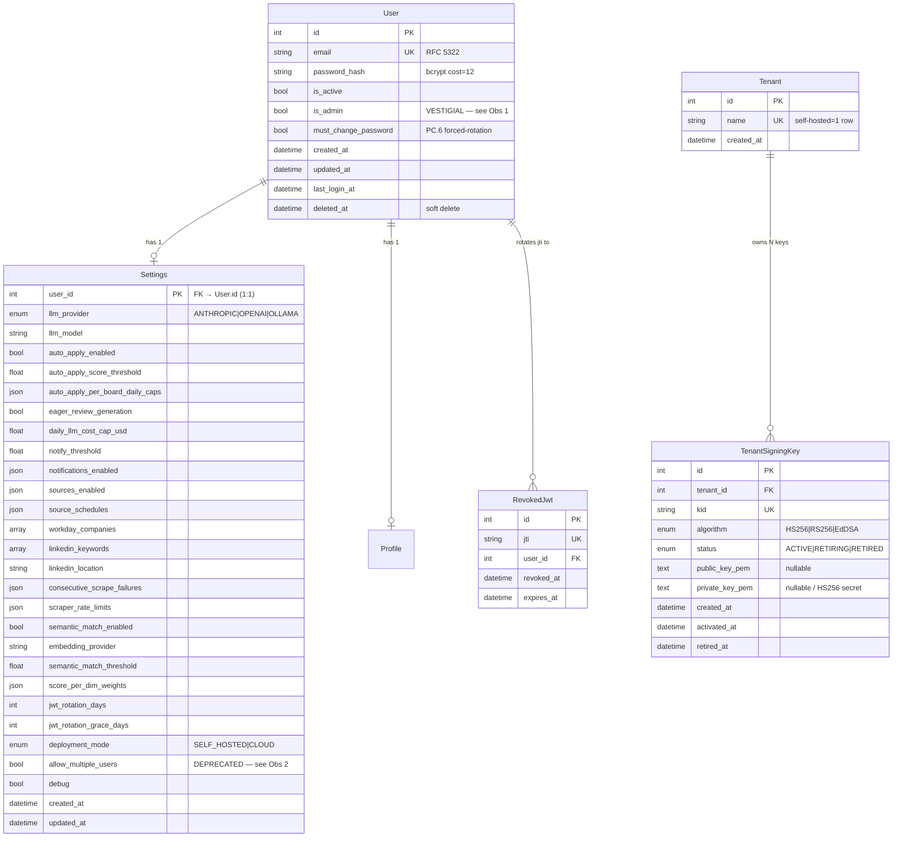
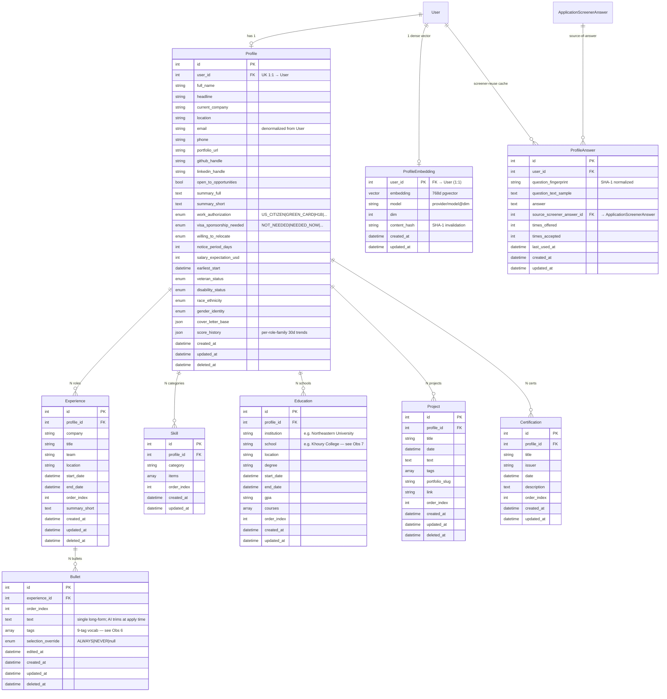
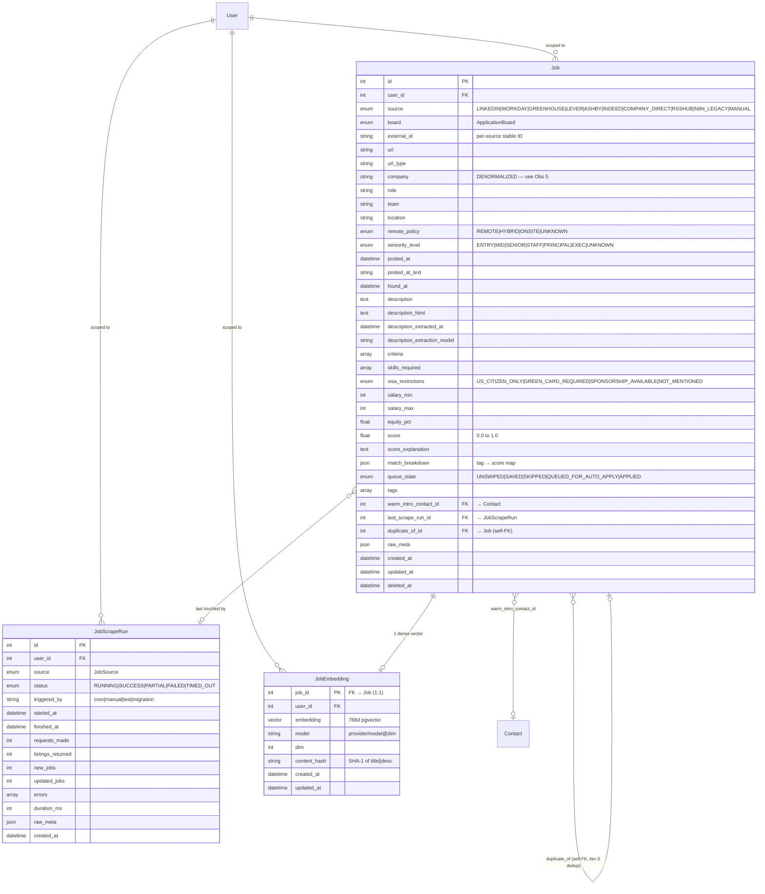
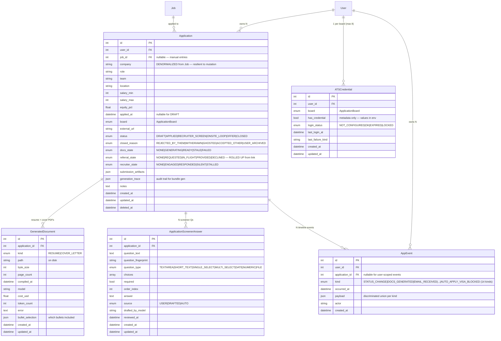
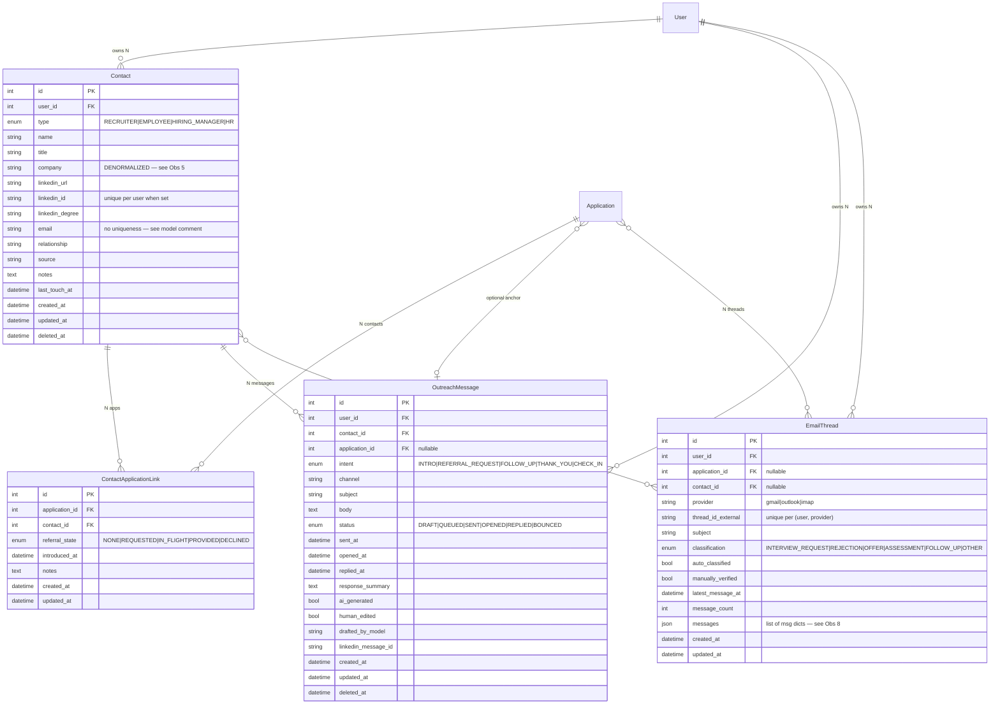
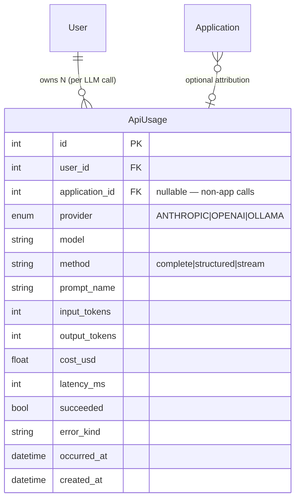

# Naavik — Entity-Relationship Diagram

> **Authored:** 2026-05-25 (plan 89 / 0.7.0.48 Wave 2 item 6 — owner-requested visual data model review)
> **Source of truth:** `src/models/**.py` SQLModel definitions (this doc is a mermaid render of those)
> **Complement, not replacement:** `docs/design/DATA_MODEL.md` is the field-level + state-transition reference; this doc is the visual + critique surface
> **Render hint:** mermaid blocks below render inline in GitHub markdown — view via the PR diff or `gh pr view 212 --web`

---

## Index

27 SQLModel tables split across 6 domains:

1. **Auth & Identity** — `User`, `Settings`, `RevokedJwt`, `Tenant`, `TenantSigningKey`
2. **Profile** — `Profile`, `Experience`, `Bullet`, `Skill`, `Education`, `Project`, `Certification`, `ProfileEmbedding`, `ProfileAnswer`
3. **Jobs & Scraping** — `Job`, `JobEmbedding`, `JobScrapeRun`
4. **Applications & Documents** — `Application`, `GeneratedDocument`, `ApplicationScreenerAnswer`, `ATSCredential`, `AppEvent`
5. **Contacts & Outreach** — `Contact`, `ContactApplicationLink`, `OutreachMessage`, `EmailThread`
6. **Observability** — `ApiUsage`

Cardinality glyphs (mermaid): `||--o{` one-to-many, `||--||` one-to-one, `||--o|` one-to-zero-or-one, `}o--o|` many-to-zero-or-one.

Owner cuts to the chase: jump to [§ Observations / open questions](#observations--open-questions) — the architect's critique with actionable suggestions.

---

## 1 · Auth & Identity



**Notes:**
- `User.id` is the FK target for every per-user-scoped row in the whole schema.
- `Settings` is keyed by `user_id` directly (not its own `id` PK), enforcing 1:1.
- `TenantSigningKey` is **NOT** scoped to `User` — it's scoped to `Tenant`. On self-host there's one `Tenant` row (`id=1, name='self-hosted'`), but the indirection is there for future multi-tenant blast-radius isolation (per plan 62 / 0.2.7.07).

---

## 2 · Profile



**Notes:**
- `Profile.email` duplicates `User.email`. Per `DATA_MODEL.md`, intentional denormalization for resume rendering (Profile is the resume contract).
- `Bullet.text` is single-field long-form — AI trims at apply time. `tags` use a closed 9-value vocab (AI_ML, BACKEND, FRONTEND, DEVOPS, DATA_ENG, GENAI, LEADERSHIP, PLATFORM, PRODUCT) but the column is `array<string>` not `array<enum>`. See Obs 6.
- `ProfileAnswer.source_screener_answer_id` FKs back into `ApplicationScreenerAnswer` — that's the only profile-domain row with a cross-domain FK.

---

## 3 · Jobs & Scraping



**Notes:**
- Primary dedup constraint: partial-unique index on `(user_id, source, external_id) WHERE deleted_at IS NULL`. The `duplicate_of_id` self-FK is tier-3 fuzzy dedup (per plan 34 / 0.2.0.09).
- `JobEmbedding.user_id` is **redundant with `Job.user_id`** — kept as a denormalized index for fast per-user vector search (plan 61 decision D5).
- `Job.warm_intro_contact_id` is the only direct Job → Contact FK; the rest of the application-contact graph flows via `ContactApplicationLink`.

---

## 4 · Applications, Documents, Events



**Notes:**
- `Application` denormalizes 5 identifying fields from `Job` (`company`, `role`, `team`, `location`, `salary_*`). Intentional — Job can mutate; the Application snapshot is what you applied to.
- `Application.referral_state` is a **service-layer rollup** of all `ContactApplicationLink.referral_state` rows for the same application; not directly stored as the source of truth. See `application_service._roll_up_referral_state`.
- `AppEvent.payload` is JSONB but shaped per `AppEventKind` via Pydantic discriminated union in `app_event_payloads.py` (14 payload classes; opaque to Postgres, typed in Python).
- `ATSCredential.has_credential` is metadata — actual secret material lives in `.env` since plan 26 (vault sunset).

---

## 5 · Contacts & Outreach



**Notes:**
- `ContactApplicationLink` is the canonical many-to-many. Per-link `referral_state` is source of truth; `Application.referral_state` is the service-layer rollup.
- `EmailThread.messages` stores the full message list as JSONB (no separate `EmailMessage` table). DATA_MODEL.md flags this as "Phase 2+ may promote to a separate `EmailMessage` table." See Obs 8.

---

## 6 · Observability



**Notes:**
- Every LLM call routes through `services/llm_tracker.tracked_call(...)` which writes one `ApiUsage` row. Powers the daily cost cap + Settings · LLM cost cards.
- `application_id` is nullable for non-application LLM work (resume parse, embeddings, scoring without a draft).

---

## 7 · External (not SQLModel — for context)

The schema also touches a few non-model surfaces relevant to the data model:

- **APScheduler jobstore tables** — `apscheduler_jobs` is created by APScheduler itself (alembic doesn't manage it). Lives in the same Postgres DB; opaque to Naavik's models.
- **pgvector extension** — backs `JobEmbedding.embedding` and `ProfileEmbedding.embedding` (both `vector(768)`).
- **Alembic migrations** — 22 migration files (`migrations/versions/0001` through `0022`) — head is `0022_closed_reason_user_archived`. Schema changes flow through alembic, not SQLModel autogen alone.

---

## Observations / open questions

Architect's lens applied to the data model. Each item is **actionable** — owner can pick which to file as `0.7.0.49+` follow-up rows or roll into a future cleanup plan.

### Obs 1 — `User.is_admin` is vestigial; remove the concept entirely (HIGH)

**Finding:** `is_admin` is set during signup (`is_first_user = existing_count == 0` → `User.is_admin=is_first_user`) and returned in the `/api/v1/auth/me` payload, but **no code path anywhere in `src/` gates on it.** No `if user.is_admin:` checks, no admin-only routes, no admin-scoped service operations. The owner's question in plan 89 W2 item 2 is correct: there are no admin-only operations in this app.

Plan 89 Wave 2 item 2 currently plans to "flip default to True; keep column for schema compat; drop in 0.7.0.49." That's the right transitional move. But the **stronger position** is: there is no concept of admin in a single-tenant self-hosted app where every user owns only their own data. The model invariant should be "all signed-up users are equal." Recommend:

1. **Now (this PR):** flip default to `True` as planned (column drop deferred to 0.7.0.49) — matches the plan.
2. **0.7.0.49 (next):** alembic migration to **DROP the column**, not just deprecate. Remove from `/api/v1/auth/me` response. Remove from `User` model.
3. **Future (if multi-tenant SaaS):** introduce a `Role` enum (`OWNER|MEMBER|VIEWER`) per **`Tenant`**, not per `User`. `is_admin` boolean was an MVP shortcut; even multi-tenant deserves better.

**Why this matters:** keeping vestigial fields is the leading cause of "this codebase feels confusing" — they signal capability that doesn't exist, and the next implementer wastes a half-day searching for the admin gate. The plan's "flip default" half-measure is correct for this PR's scope; commit to the full removal in 0.7.0.49.

### Obs 2 — `Settings.allow_multiple_users` should drop in same 0.7.0.49 (MEDIUM)

**Finding:** Already marked deprecated in `src/models/settings.py:196-200`. Field is no longer read by code (plan 89 W1 removed the signup gate). The column will sit in production DBs as a vestigial `boolean DEFAULT true` taking 1 byte/row × however many self-hosted instances. Trivial overhead, but **semantic noise**: a new contributor reads the model file and asks "is this a feature flag I can flip?"

**Recommendation:** Bundle this drop with the `is_admin` drop into one alembic migration in 0.7.0.49. Both are vestigial 1-byte booleans from the same MVP gating concept. A combined "remove single-user MVP vestiges" migration is cleaner than two separate ones.

### Obs 3 — Company is denormalized as a STRING across 3 tables; no `Company` entity (HIGH)

**Finding:** `Job.company`, `Application.company`, `Contact.company` are all free-form `string` columns. No FK to a `Company` table. Consequences:

- "Find all jobs at Stripe" — fuzzy string match (the existing GIN trigram index on `lower(company)` per plan 34 acknowledges this pain).
- "How many applications at company X" — depends on perfect string consistency across scrape runs ("Stripe" vs "Stripe Inc" vs "Stripe, Inc.").
- Contact relationships are weakened — "show me everyone I know at Stripe" needs the same fuzzy join.

**Recommendation (low-urgency but architecturally significant):** Introduce a `Company` entity in a Phase 2.5 or Phase 3 cleanup plan:

```
Company {
    id PK
    canonical_name (e.g. "Stripe")
    aliases array<string> (e.g. ["Stripe Inc", "Stripe, Inc."])
    website
    linkedin_url
    industry
    size_category
    created_at, updated_at
}
```

Then `Job.company_id FK`, `Application.company_id FK`, `Contact.company_id FK`. Keep the denormalized string columns for backward compat + display fallback; populate `*_id` lazily via a normalization service. This unlocks: per-company application history, "you have 3 contacts here" badge on Job cards, real warm-intro discovery, application-rate analytics by company.

**Cost:** ~2 weeks of design + migration. Worth a Phase 3 design plan, not a quick W2 follow-up.

### Obs 4 — `Tenant` + `TenantSigningKey` are over-engineered for the current single-tenant MVP (MEDIUM)

**Finding:** Plan 62 / 0.2.7.07 introduced JWT key rotation via a per-tenant signing-key table. The `Tenant` table exists with exactly one row (`id=1, name='self-hosted'`) on every self-host. `TenantSigningKey.tenant_id` always = 1. This is **forward-looking architecture** for multi-tenant SaaS that doesn't ship until Phase 0.8.x at earliest.

**Trade-off analysis:**

| Option | Pro | Con |
|---|---|---|
| Keep current (Tenant + TenantSigningKey) | Future-proof; one less migration when SaaS lands | Adds a JOIN to every JWT verification; 2 extra tables; conceptually confusing for self-hosters reading the schema |
| Collapse to `SigningKey` (drop Tenant, drop tenant_id FK) | Simpler; 1 fewer table; matches single-tenant reality | Pays migration cost twice — once now, once when SaaS lands |
| Status quo | (same as option 1) | (same as option 1) |

**Recommendation:** Keep status quo. The cost (1 JOIN on JWT verify, 1 fixed row in `tenant`) is trivial; the future migration cost is non-trivial. **But add a doc-line** in the `Tenant` model docstring stating that the table will stay 1-row until multi-tenant SaaS ships, so contributors don't try to "use" it for organization-scoping or similar shoehorns.

### Obs 5 — Profile and Settings could collapse, BUT shouldn't (LOW — design note)

**Finding:** Owner's hand-back mentioned this as a possible simplification. Worth addressing:

`Profile` and `Settings` are both 1:1 with `User`. Why not one row?

**Why they're correctly separate:**

1. **Different lifecycle.** `Profile` is the resume/CV contract — fields are PII (name, EEO, salary expectation). `Settings` is operator config — LLM provider, auto-apply toggles, cron schedules. Different update cadences, different review surfaces (Profile · Edit vs Settings).
2. **Different contributor.** Resume gets edited monthly; Settings gets touched at setup + rare ops changes.
3. **Different export.** `GET /api/portfolio/cv` (public, no auth) reads Profile, never Settings.
4. **Different validation.** Profile fields are user-facing (name regex, email RFC); Settings fields are operator-facing (URL validation, enum constraints).

**Recommendation:** keep them separate. The 1:1 relationship is the right shape — both are "extension tables on User" with different concerns.

### Obs 6 — `Bullet.tags` is `array<string>` but the vocab is closed 9 values (LOW)

**Finding:** `Tag` enum exists in `src/models/enums.py` with exactly 9 values (`AI_ML`, `BACKEND`, `FRONTEND`, `DEVOPS`, `DATA_ENG`, `GENAI`, `LEADERSHIP`, `PLATFORM`, `PRODUCT`). But `Bullet.tags: array<string>` accepts any string. Risk: typo-tags pollute the field (`backed`, `devp`).

**Recommendation:** In a quick cleanup row (`0.7.0.NN`), add a Pydantic validator in the API surface (`BulletCreate`/`BulletUpdate`) that constrains tags to the 9-value enum. Optionally add a `CHECK` constraint at the DB level (PG supports `CHECK (tags <@ ARRAY['ai-ml','backend',...])`). Same fix applies to `Project.tags` (also `array<string>`).

### Obs 7 — `Education.institution` AND `Education.school` columns both exist (LOW)

**Finding:** Both columns are present in `src/models/profile.py:208-209`. Both are rendered in `src/ui/templates/pages/profile.html:83` as `{{ e.institution }} · {{ e.school }}` (institution = "Northeastern University", school = "Khoury College of Computer Sciences"). So they ARE semantically distinct (institution = parent org, school = sub-division), but the naming is unhelpful and DATA_MODEL.md doesn't document the distinction.

**Recommendation:** Rename `school` → `department` (more universally meaningful) OR document the distinction inline in the model docstring. Cheap rename + alembic column rename + 1 template + 1 ctx-builder reference. File as `0.7.0.NN` cleanup.

### Obs 8 — `EmailThread.messages` as JSONB blob is a known smell (MEDIUM, deferred)

**Finding:** `EmailThread.messages: list = Field(sa_column=Column(JSONB, ...))` stores the full message list inline. DATA_MODEL.md already flags this as "Phase 2+ may promote to a separate `EmailMessage` table."

**Consequences right now:**
- Can't query individual messages (e.g. "find emails containing 'salary'" requires full JSONB scan).
- Can't link an individual message to an `AppEvent` (kind=`EMAIL_RECEIVED` payload references `message_id_external` as a string, not a FK).
- Thread row grows unbounded with reply chains.

**Recommendation:** This is correctly deferred. Phase 5 (Email Monitoring & Outreach) is the natural home for the `EmailMessage` table promotion. Don't pre-build it now. But add a note in DATA_MODEL.md § C.14 (EmailThread) tying the promotion to a specific Phase 5 task ID once Phase 5 plans materialize.

### Obs 9 — Soft-delete inconsistency (LOW)

**Finding:** `deleted_at` columns appear on `User`, `Profile`, `Experience`, `Bullet`, `Project`, `Job`, `Application`, `Contact`, `OutreachMessage`. But NOT on `Skill`, `Education`, `Certification`, `Settings`, `ATSCredential`, `GeneratedDocument`, `ApplicationScreenerAnswer`, `JobScrapeRun`, `JobEmbedding`, `ProfileEmbedding`, `ProfileAnswer`, `AppEvent`, `ApiUsage`, `EmailThread`, `ContactApplicationLink`, `RevokedJwt`, `Tenant`, `TenantSigningKey`.

`DATA_MODEL.md § C` says the rule is "soft-delete on user-authored entities; hard-delete on Settings test rows + ephemeral state." That mostly tracks, but: **why is `Skill` hard-delete when `Bullet` is soft-delete?** Both are user-authored Profile children. Same for `Education` (hard) vs `Project` (soft).

**Recommendation:** Either add `deleted_at` to `Skill` + `Education` + `Certification` for consistency, OR document why those three are intentionally hard-delete (e.g. "operator can re-add easily; no audit trail value"). The current mix is undocumented inconsistency.

### Obs 10 — `JobEmbedding.user_id` is redundant with `Job.user_id` (INFO)

**Finding:** `JobEmbedding` has both `job_id PK` (which already implies a `Job` row) and `user_id FK` (denormalized from `Job`). Plan 61 decision D5 justified this as a perf index for per-user vector search.

**Recommendation:** This is correct as designed. Mentioning for transparency only — owner reading the schema will notice the apparent duplication. Worth a one-line comment in the JobEmbedding docstring linking to plan 61 § D5.

### Obs 11 — Naming consistency check (INFO)

**Finding:** All table names are `snake_case` singular (`user`, `application`, `job_scrape_run`). All column names are `snake_case`. No camelCase leakage. Enum values are mixed: some `UPPER_SNAKE_CASE` (`DRAFT`, `APPLIED`, `RUNNING`), some `lower_snake_case` (`rejected_by_them`, `linkedin`, `greenhouse`).

**Recommendation:** The enum value casing inconsistency is real but **expensive to fix** — every enum value is a stored string in Postgres; flipping case is an alembic data migration per enum. Not worth chasing for cosmetic consistency. Document the pattern in DATA_MODEL.md § D so the next contributor knows: "STATUS-type enums use UPPER (DRAFT, APPLIED); SOURCE/CATEGORY-type enums use lower (linkedin, greenhouse)." That's actually a defensible pattern.

### Obs 12 — Multi-tenant readiness — `user_id` everywhere (INFO)

**Finding:** Every per-user table carries `user_id FK` directly. Cross-user data leak attack surface is "did the service layer remember to filter by user_id?" — this is exactly what 0.3.3.15 closed for the screener IDOR.

**Recommendation:** Already on the right track. The `tests/test_no_cross_user_embedding_reads.py` regression-lint pattern is good — extend it to assertion templates that flag any `select(<Model>)` without a `.where(<Model>.user_id == ...)` in service code. File as a 0.7.0.NN test-tooling improvement if useful.

---

## Footer

This ERD complements — does NOT replace — `docs/design/DATA_MODEL.md`. Cross-reference:

- **Field-level spec + state transitions + KPI derivations + sample row counts:** see DATA_MODEL.md § C–F.
- **Migration strategy (alembic head, autogen vs handwritten):** DATA_MODEL.md § H.
- **Enum vocabulary tables (full enum-to-int maps):** DATA_MODEL.md § D.
- **AppEvent payload schemas (per-kind Pydantic discriminated union):** DATA_MODEL.md § M + `src/models/app_event_payloads.py`.
- **Job model deep-dive (post plan-27 hardening):** `docs/design/JOB_MODEL.md`.
- **JWT rotation key lifecycle:** `docs/design/JWT_ROTATION.md` (if present) + plan 62 § B.1.

**Update cadence:** this doc is regenerated when significant model surgery lands (new entity, dropped column, new FK). Light field tweaks don't need a re-render — DATA_MODEL.md absorbs those. Re-render trigger phrases for future runs: "regenerate ERD," "update the entity diagram," "ERD is stale."
