# Naavik — Unified Entity-Relationship Diagram v2

> **Authored:** 2026-05-26 — Hermes audit + single-diagram regeneration from `docs/design/ERD.md`
> **Source of truth:** `src/models/**.py` SQLModel definitions (verified 2026-05-26 against commit `470ce57`)
> **Companion:** `docs/design/DATA_MODEL.md` (field-level + state-transition reference)
> **Diff from v1:** Single `erDiagram` block (was 6 categorized diagrams); 12 discrepancy groups fixed or documented below.

---

## Verification Summary

Inventory result: 27 SQLModel tables found via `src.models.__all__` and SQLAlchemy table metadata. No registered table was missing from v1, but v1 was stale in several field and enum areas, and it described SQLModel relationship objects using the `back_populates` argument even though those objects no longer exist in the code.

| Table | Discrepancy | Severity | Fixed? |
|---|---|---:|---|
| All tables | v1/data-model prose repeatedly describes SQLModel relationship objects using the `back_populates` argument; code comments in `user.py` and `application.py` say relationships were removed in Wave 3 because SQLModel 0.0.22 forward refs were brittle. Services use explicit FK joins. | HIGH | Documented; v2 diagram is generated from FKs, not ORM relationships. |
| Settings | v1 omits newer Settings columns: `llm_fallback_provider`, `auto_apply_daily_cap`, `auto_apply_immediate_dispatch`, `auto_apply_adapter_confidence_threshold`, `auto_apply_dry_run`, `indeed_keywords`, `indeed_location`, `semantic_match_sync_on_upsert`, `ai_writing_voice_samples`, `cover_letter_format`, `tier_2_evasion_enabled`, `resume_template_preference`, `parse_fidelity_threshold`, `generation_tier`, `originality_api_key`. | HIGH | Key new knobs shown in v2; full inventory remains in code/DATA_MODEL. |
| Profile | v1 omits `raw_resume_text`, a nullable `TEXT` column backing the profile edit parsed-source panel. | LOW | Added as a semantically significant column. |
| Application | v1 says closed reasons include `WITHDRAWN`; code enum uses `withdrawn_by_me` and now includes `user_archived`. | HIGH | v2 annotates current enum values. |
| AppEvent | v1 says AppEvent has 14 event kinds; code has 15 (`AUTO_APPLY_QUEUED` exists in addition to dry-run/drained/visa-blocked). | HIGH | v2 says 15 kinds. |
| StatusChangeTrigger enum | DATA_MODEL/v1-era examples omit `CLEANUP_STALE`; code includes it. | LOW | Documented in critique as enum/documentation drift. |
| ProfileAnswer | `source_screener_answer_id` is required/non-null in code; v1 only says FK, without emphasizing that every reusable answer must point to an originating screener answer. | LOW | v2 marks it as required provenance. |
| ATSCredential | Audit confirmed `board` is a free enum column, not an FK to a board/source table. | LOW | v2 keeps it as enum; critique flags enum rigidity. |
| Contact | Audit confirmed `email` is not unique; v1's note is correct despite older DATA_MODEL text mentioning future uniqueness. | LOW | Preserved. |
| Date/time columns | Code uses timezone-aware `DateTime(timezone=True)` via explicit SQLAlchemy columns; v1 shows generic `datetime`. | LOW | v2 keeps Mermaid-generic `datetime`; noted here because Mermaid cannot express tz precision cleanly. |
| JSON columns | Code uses PostgreSQL `JSONB`; v1 often says `json`. | LOW | v2 uses `json` for Mermaid compatibility; critique calls out JSONB schema risk. |
| Cross-domain FKs | v1 contained most cross-domain lines but split them across domain diagrams, hiding the whole graph. | MEDIUM | v2 includes every FK pair in one flat diagram. |

---

## Unified ERD

```mermaid
%%{init: {'theme': 'base'}}%%
erDiagram
    %% All 27 SQLModel tables in one flat FK graph. Relationship lines are
    %% derived from ForeignKey metadata, not SQLModel Relationship declarations.

    User ||--o| Settings : "settings.user_id"
    User ||--o| Profile : "profile.user_id"
    User ||--o| ProfileEmbedding : "profile_embedding.user_id"
    User ||--o{ RevokedJwt : "revoked_jwt.user_id"
    User ||--o{ ProfileAnswer : "profile_answer.user_id"
    User ||--o{ Job : "job.user_id"
    User ||--o{ JobEmbedding : "job_embedding.user_id"
    User ||--o{ JobScrapeRun : "job_scrape_run.user_id"
    User ||--o{ Application : "application.user_id"
    User ||--o{ ATSCredential : "ats_credential.user_id"
    User ||--o{ AppEvent : "app_event.user_id"
    User ||--o{ Contact : "contact.user_id"
    User ||--o{ OutreachMessage : "outreach_message.user_id"
    User ||--o{ EmailThread : "email_thread.user_id"
    User ||--o{ ApiUsage : "api_usage.user_id"

    Tenant ||--o{ TenantSigningKey : "tenant_signing_key.tenant_id"

    Profile ||--o{ Experience : "experience.profile_id"
    Profile ||--o{ Skill : "skill.profile_id"
    Profile ||--o{ Education : "education.profile_id"
    Profile ||--o{ Project : "project.profile_id"
    Profile ||--o{ Certification : "certification.profile_id"
    Experience ||--o{ Bullet : "bullet.experience_id"

    ApplicationScreenerAnswer ||--o{ ProfileAnswer : "profile_answer.source_screener_answer_id"

    Job ||--o| JobEmbedding : "job_embedding.job_id"
    JobScrapeRun o|--o{ Job : "job.last_scrape_run_id"
    Contact o|--o{ Job : "job.warm_intro_contact_id"
    Job o|--o{ Job : "job.duplicate_of_id"
    Job o|--o{ Application : "application.job_id"

    Application ||--o{ GeneratedDocument : "generated_document.application_id"
    Application ||--o{ ApplicationScreenerAnswer : "application_screener_answer.application_id"
    Application ||--o{ ContactApplicationLink : "contact_application_link.application_id"
    Contact ||--o{ ContactApplicationLink : "contact_application_link.contact_id"
    Contact ||--o{ OutreachMessage : "outreach_message.contact_id"
    Application o|--o{ OutreachMessage : "outreach_message.application_id"
    Application o|--o{ EmailThread : "email_thread.application_id"
    Contact o|--o{ EmailThread : "email_thread.contact_id"
    Application o|--o{ AppEvent : "app_event.application_id"
    Application o|--o{ ApiUsage : "api_usage.application_id"

    User {
        int id PK
        string email UK "unique login"
        string password_hash "bcrypt"
        bool is_active
        bool is_admin "deprecated vestige"
        bool must_change_password
        datetime deleted_at "soft delete"
    }

    Settings {
        int user_id PK,FK "1 row per user"
        string llm_provider
        string llm_model
        string llm_fallback_provider "nullable"
        bool auto_apply_enabled
        float auto_apply_score_threshold
        int auto_apply_daily_cap "nullable"
        json auto_apply_per_board_daily_caps
        bool auto_apply_dry_run
        bool semantic_match_enabled
        string embedding_provider "nullable"
        float semantic_match_threshold
        bool semantic_match_sync_on_upsert
        string generation_tier "free or premium"
        string originality_api_key "nullable secret-ish"
        bool allow_multiple_users "deprecated"
    }

    RevokedJwt {
        int id PK
        string jti UK "JWT ID"
        int user_id FK
        datetime revoked_at
        datetime expires_at
    }

    Tenant {
        int id PK
        string name UK "self-hosted row"
        datetime created_at
    }

    TenantSigningKey {
        int id PK
        int tenant_id FK
        string kid UK "JWT kid"
        string algorithm "HS256 RS256 EdDSA"
        string status "ACTIVE RETIRING RETIRED"
        text public_key_pem "nullable"
        text private_key_pem "secret material"
    }

    Profile {
        int id PK
        int user_id FK,UK
        string full_name
        string headline
        string email "denorm from User"
        string work_authorization "nullable"
        string visa_sponsorship_needed "nullable"
        json score_history "30d score trends"
        text raw_resume_text "parsed upload source"
        datetime deleted_at "soft delete"
    }

    Experience {
        int id PK
        int profile_id FK
        string company
        string title
        datetime start_date
        datetime end_date "nullable"
        int order_index
        datetime deleted_at "soft delete"
    }

    Bullet {
        int id PK
        int experience_id FK
        int order_index
        string text "long form"
        array tags "9-tag vocab unchecked by DB"
        string selection_override "nullable"
        datetime edited_at "nullable"
    }

    Skill {
        int id PK
        int profile_id FK
        string category
        array items
        int order_index
    }

    Education {
        int id PK
        int profile_id FK
        string institution
        string school "sub-school"
        string degree
        array courses
        int order_index
    }

    Project {
        int id PK
        int profile_id FK
        string title
        string text
        array tags "9-tag vocab unchecked by DB"
        string portfolio_slug "nullable"
        datetime deleted_at "soft delete"
    }

    Certification {
        int id PK
        int profile_id FK
        string title
        string issuer
        datetime date "nullable"
        int order_index
    }

    ProfileEmbedding {
        int user_id PK,FK
        vector embedding "768d"
        string model
        int dim
        string content_hash
        datetime updated_at
    }

    ProfileAnswer {
        int id PK
        int user_id FK
        string question_fingerprint UK "with user_id"
        text question_text_sample
        text answer
        int source_screener_answer_id FK "required provenance"
        datetime last_used_at
    }

    Job {
        int id PK
        int user_id FK
        string source "JobSource"
        string board "ApplicationBoard enum"
        string external_id "unique with user source"
        string company "free text"
        string role
        string remote_policy
        string seniority_level "nullable"
        float score "0 to 1"
        string queue_state
        int warm_intro_contact_id FK "nullable"
        int last_scrape_run_id FK "nullable"
        int duplicate_of_id FK "nullable self-FK"
        datetime deleted_at "soft delete"
    }

    JobEmbedding {
        int job_id PK,FK
        int user_id FK "denorm from Job"
        vector embedding "768d"
        string model
        int dim
        string content_hash
    }

    JobScrapeRun {
        int id PK
        int user_id FK
        string source "JobSource"
        string status "running success partial failed timed_out"
        string triggered_by "free form"
        datetime started_at
        datetime finished_at "nullable"
        array errors
    }

    Application {
        int id PK
        int user_id FK
        int job_id FK "nullable manual app"
        string company "snapshot"
        string role "snapshot"
        string board "nullable enum"
        string status "DRAFT APPLIED etc"
        string closed_reason "includes user_archived"
        string docs_state
        string referral_state "rollup"
        string recruiter_state
        json generation_trace
        datetime deleted_at "soft delete"
    }

    GeneratedDocument {
        int id PK
        int application_id FK
        string kind "resume cover_letter"
        string path "filesystem metadata"
        int byte_size
        datetime compiled_at
        float cost_usd "nullable"
        json bullet_selection "resume only"
    }

    ApplicationScreenerAnswer {
        int id PK
        int application_id FK
        text question_text
        string question_fingerprint
        string question_type
        array choices "nullable"
        text answer "nullable"
        string source "user drafted auto"
    }

    ATSCredential {
        int id PK
        int user_id FK
        string board UK "enum not FK"
        bool has_credential "env-backed metadata"
        string login_status
        datetime last_login_at "nullable"
        string last_failure_kind "nullable"
    }

    AppEvent {
        int id PK
        int user_id FK
        int application_id FK "nullable"
        string kind "15 event kinds"
        datetime occurred_at
        json payload "typed in Python"
        string actor "nullable"
    }

    Contact {
        int id PK
        int user_id FK
        string type "recruiter employee etc"
        string name
        string company "free text"
        string linkedin_id "unique per user when set"
        string email "not unique"
        datetime last_touch_at "nullable"
        datetime deleted_at "soft delete"
    }

    ContactApplicationLink {
        int id PK
        int application_id FK,UK "unique pair"
        int contact_id FK,UK "unique pair"
        string referral_state
        datetime introduced_at "nullable"
        text notes "nullable"
    }

    OutreachMessage {
        int id PK
        int user_id FK
        int contact_id FK
        int application_id FK "nullable"
        string intent
        string channel
        string status
        datetime sent_at "nullable"
        datetime replied_at "nullable"
        datetime deleted_at "soft delete"
    }

    EmailThread {
        int id PK
        int user_id FK,UK "with thread_id_external"
        int application_id FK "nullable"
        int contact_id FK "nullable"
        string provider
        string thread_id_external UK
        string classification
        datetime latest_message_at
        json messages "inline list"
    }

    ApiUsage {
        int id PK
        int user_id FK
        int application_id FK "nullable"
        string provider
        string model
        string prompt_name "nullable"
        int input_tokens
        int output_tokens
        float cost_usd
        datetime occurred_at
    }
```



---

## Critique

### Redundancies That Can Be Eliminated

1. **`JobEmbedding.user_id` duplicates `Job.user_id`.**
   - What: `job_embedding.job_id` already implies the owning `job.user_id`, but `job_embedding.user_id` repeats it.
   - Why: Plan 61 D5 calls it a perf index for per-user vector search; semantic scoring needs `WHERE user_id = ?` before vector ranking.
   - Take: Keep it. Avoiding a join inside the hot pgvector path is worth one duplicated integer. Add a DB/service invariant test that the two user IDs match when writing embeddings.
   - Alternative: Drop it only if vector search volume remains tiny and every semantic query can afford `JOIN job`.

2. **`Profile.email` duplicates `User.email`.**
   - What: Auth email and resume/contact email are both stored.
   - Why: Profile is the resume rendering contract; resume exports should not have to join auth or mirror a future login-email change automatically.
   - Take: Keep it. This is useful denormalization because login email and resume email can legitimately diverge.
   - Alternative: Rename/comment as `resume_email` if contributors keep assuming it must match `User.email`.

3. **`Application.company`, `role`, `team`, `location`, `salary_min`, `salary_max`, `equity_pct` duplicate `Job` fields.**
   - What: Application stores a snapshot of identifying job data.
   - Why: Application is what the user actually applied to; a scraped Job can mutate or be deduped later.
   - Take: Strongly agree. This is the correct audit/snapshot pattern.
   - Alternative: None for the core fields. The only improvement is to record the snapshot source version in `generation_trace` or an `AppEvent` if disputes matter later.

4. **`Contact.company` duplicates Job/Application company strings.**
   - What: Contacts are tied to companies by free-form text, not a `Company` FK.
   - Why: MVP avoids a company-normalization subsystem.
   - Take: Acceptable for MVP, but this is the biggest future analytics tax. Every company query becomes fuzzy matching.
   - Alternative: Add `Company(id, canonical_name, aliases, domain, linkedin_url)` and nullable `company_id` on Job/Application/Contact while keeping strings as display fallbacks.

5. **`Tenant` is a one-row root for self-hosted installs.**
   - What: `tenant` and `tenant_signing_key.tenant_id` exist even though all self-host installs use `id=1`.
   - Why: Future cloud/multi-tenant JWT key blast-radius isolation.
   - Take: Keep it. The extra table is conceptual overhead, but collapsing now would create churn before SaaS.
   - Alternative: If Naavik formally abandons cloud multi-tenancy, collapse to `SigningKey` and drop `tenant`.

6. **`order_index` columns on Profile children are repeated across `Experience`, `Bullet`, `Skill`, `Education`, `Project`, `Certification`.**
   - What: Manual display order is stored per row.
   - Why: Drag/drop ordering beats deriving display order from dates or created_at.
   - Take: Keep for user-authored resume sections. It is not worth linked-list complexity.
   - Alternative: Add a service helper to compact/rebalance order values so every editor does not reimplement ordering.

7. **JSONB columns overlap with structured columns in spirit, not exact content.**
   - Examples: `Job.match_breakdown` duplicates the top-level `Job.score`; `Application.generation_trace` overlaps `GeneratedDocument` metadata; `EmailThread.messages` repeats thread-level `classification` clues.
   - Take: Some duplication is useful for audit traces, but the risk is that UI starts reading JSONB instead of source-of-truth columns.
   - Alternative: Document ownership: top-level columns are queryable current state; JSONB is trace/debug detail unless explicitly indexed.

### Friction Points (What Slows Down New Features)

1. **No ORM relationships means every feature writes joins by hand.**
   The code intentionally removed SQLModel `Relationship()` declarations. That makes mapper setup more stable, but it shifts cognitive load to every service. New contributors must know FK names and user scoping manually.

2. **Company is not an entity.**
   UC1-style queries require fuzzy string matching across `job.company`, `contact.company`, and `application.company`. It is manageable with trigram indexes, but analytics and warm-intro badges will keep paying this tax.

3. **Soft-delete policy is inconsistent.**
   User-authored `Bullet` and `Project` soft-delete, but `Skill`, `Education`, and `Certification` hard-delete. `EmailThread` has no `deleted_at`, so hiding an imported noisy thread needs a classification/status workaround. The policy is partly defensible but under-documented.

4. **Enums are operationally rigid.**
   `ApplicationBoard`, `JobSource`, `AppEventKind`, and ATS/login enums change as integrations grow. Every new board/source/event kind is an Alembic enum migration. That is correct for core states, less ideal for vendor/source catalogs.

5. **Settings is becoming a junk drawer.**
   It is one row per user with dozens of toggles spanning LLMs, scraping, auto-apply, JWT rotation, generation tiers, CORS, and secrets-adjacent fields. This is fast for Settings UI reads but slows reasoning and migrations.

6. **JSONB schema enforcement lives outside Postgres.**
   `auto_apply_per_board_daily_caps`, `score_per_dim_weights`, `generation_trace`, `submission_artifacts`, `AppEvent.payload`, and `EmailThread.messages` are typed in Python or comments. Bad writes can land unless every writer goes through the right service.

7. **Cross-domain queries frequently span 4+ tables.**
   Warm-intro discovery and tailored resume generation naturally cross Job/Application/Profile/Contact/Document/Usage. The schema is accurate to the domain, but feature work needs well-named service query helpers or views.

8. **`TenantSigningKey.private_key_pem` stores key material in Postgres.**
   This is explicitly documented as the trust boundary after vault deletion, but it is still security-sensitive. Backups now contain signing secrets.

9. **`ProfileAnswer.source_screener_answer_id` being required may limit manual seed answers.**
   Provenance is good, but a user-entered reusable answer not tied to a previous application cannot exist without inventing a source screener answer.

10. **Missing composite indexes for some common cross-domain scans.**
    FKs are indexed, but UC4 likely wants `OutreachMessage(user_id, status, sent_at)` plus contact/company filters. Current `(user_id, contact_id, sent_at)` helps after choosing a contact, not before.

### Use Case Walkthrough

#### UC1: Show me all jobs at Stripe, sorted by score, with contact warm-intro badges

What the user wants: Discover all Stripe opportunities and show whether the user knows someone there.

Pseudocode SQL:

```sql
SELECT j.*, c.id AS warm_contact_id, c.name AS warm_contact_name,
       COUNT(cal.id) AS application_contact_count
FROM job j
LEFT JOIN contact c ON c.id = j.warm_intro_contact_id AND c.user_id = j.user_id
LEFT JOIN application a ON a.job_id = j.id AND a.deleted_at IS NULL
LEFT JOIN contact_application_link cal ON cal.application_id = a.id
WHERE j.user_id = :user_id
  AND j.deleted_at IS NULL
  AND lower(j.company) % lower('Stripe')
ORDER BY j.score DESC, j.found_at DESC;
```

Natural or convoluted: Moderately convoluted. The direct `warm_intro_contact_id` is nice, but company matching is fuzzy and application contact links only help after an Application exists.

What would make it better: Add `Company` + `company_id`; optionally add a materialized warm-intro count per company or a service query that resolves aliases once.

#### UC2: Generate a tailored resume for this job — which bullets should I include?

What the user wants: Use the JD, profile, bullet tags, overrides, and score evidence to choose/trim bullets.

Pseudocode SQL:

```sql
SELECT j.id, j.description, j.skills_required, j.tags, j.match_breakdown,
       p.summary_full, p.summary_short,
       e.company, e.title, e.order_index AS experience_order,
       b.id AS bullet_id, b.text, b.tags, b.selection_override, b.edited_at
FROM job j
JOIN profile p ON p.user_id = j.user_id AND p.deleted_at IS NULL
JOIN experience e ON e.profile_id = p.id AND e.deleted_at IS NULL
JOIN bullet b ON b.experience_id = e.id AND b.deleted_at IS NULL
WHERE j.id = :job_id AND j.user_id = :user_id AND j.deleted_at IS NULL
ORDER BY e.order_index ASC, b.order_index ASC;
```

Natural or convoluted: Natural. The profile hierarchy is clean, and `Bullet.selection_override` is exactly the right escape hatch.

What would make it better: Enforce `Bullet.tags` against the `Tag` enum at write time or with a DB `CHECK`; add a document-generation view/helper that preorders the canonical resume corpus.

#### UC3: What's my application pipeline status for all active applications?

What the user wants: Tracking board grouped by status with recruiter/referral/docs state.

Pseudocode SQL:

```sql
SELECT a.*, j.score, j.url,
       COUNT(cal.id) FILTER (WHERE cal.referral_state = 'provided') AS provided_referrals,
       MAX(ev.occurred_at) AS last_event_at
FROM application a
LEFT JOIN job j ON j.id = a.job_id
LEFT JOIN contact_application_link cal ON cal.application_id = a.id
LEFT JOIN app_event ev ON ev.application_id = a.id
WHERE a.user_id = :user_id
  AND a.deleted_at IS NULL
  AND a.status IN ('APPLIED', 'RECRUITER_SCREEN', 'ONSITE_LOOP', 'OFFER')
GROUP BY a.id, j.id
ORDER BY a.applied_at DESC NULLS LAST;
```

Natural or convoluted: Mostly natural. Multi-axis state on Application is a good fit. Historical funnel analytics get more complex because they need `AppEvent` payloads.

What would make it better: Add typed event columns for status transitions or a derived `application_status_history` view if funnel charts become hot.

#### UC4: Find all outreach messages to recruiters at Google that I haven't followed up on in 7 days

What the user wants: Follow-up queue by company/contact.

Pseudocode SQL:

```sql
SELECT om.*, c.name, c.company, a.role, a.status AS application_status
FROM outreach_message om
JOIN contact c ON c.id = om.contact_id
LEFT JOIN application a ON a.id = om.application_id
WHERE om.user_id = :user_id
  AND om.deleted_at IS NULL
  AND c.deleted_at IS NULL
  AND c.type = 'recruiter'
  AND lower(c.company) % lower('Google')
  AND om.status = 'sent'
  AND om.sent_at < now() - interval '7 days'
  AND om.replied_at IS NULL
  AND NOT EXISTS (
      SELECT 1 FROM outreach_message newer
      WHERE newer.user_id = om.user_id
        AND newer.contact_id = om.contact_id
        AND newer.sent_at > om.sent_at
        AND newer.deleted_at IS NULL
  )
ORDER BY om.sent_at ASC;
```

Natural or convoluted: Convoluted. It needs fuzzy company matching, an anti-join for later follow-ups, and status inference from timestamps.

What would make it better: Add `next_followup_at` or an `OutreachTask` table if follow-up work becomes a core UI; add `Company` normalization.

#### UC5: How much did I spend on LLM calls for resume generation in the last 30 days?

What the user wants: Cost attribution for resume generation.

Pseudocode SQL:

```sql
SELECT SUM(au.cost_usd) AS total_cost,
       SUM(au.input_tokens) AS input_tokens,
       SUM(au.output_tokens) AS output_tokens,
       COUNT(*) AS call_count
FROM api_usage au
WHERE au.user_id = :user_id
  AND au.occurred_at >= now() - interval '30 days'
  AND au.succeeded = true
  AND (
      au.prompt_name IN ('generate_resume', 'tailor_resume', 'bundle_generate_resume')
      OR au.application_id IS NOT NULL
  );
```

Natural or convoluted: Natural if `prompt_name` is consistently named; imprecise if resume generation calls share generic prompt names.

What would make it better: Add a small enum/category column such as `usage_category` (`resume_generation`, `cover_letter`, `scoring`, `embedding`, `screener_answer`) or enforce prompt-name taxonomy centrally.

### Pros of This Design

1. **Strong user scoping.** Nearly every user-owned table has `user_id`, allowing direct service-layer ownership checks without walking through parent tables.
2. **Application snapshotting is correct.** Application records stay truthful even when Job rows mutate, dedupe, or disappear.
3. **Multi-axis application state is a good domain fit.** `status`, `docs_state`, `referral_state`, and `recruiter_state` avoid a combinatorial mega-enum.
4. **Audit/observability is unusually strong for an MVP.** `ApiUsage`, `AppEvent`, `JobScrapeRun`, `GeneratedDocument`, and JSON traces provide postmortem trails.
5. **pgvector is isolated cleanly.** Embeddings live in sibling tables with content hashes and model provenance, avoiding vector bloat on core rows.
6. **Soft delete exists on the high-risk user-authored entities.** Jobs, applications, contacts, outreach, and profile prose can be hidden without losing audit context.
7. **Constraint coverage is meaningful where it matters.** Score range, salary ordering, required closed reason, non-negative counters, unique job dedupe, and unique profile-answer fingerprints are enforced.
8. **Secrets boundary is explicit.** Most operational secrets moved to env/presence indicators; the one exception, JWT signing key material, is explicitly documented.

### Cons / Risks

1. **Missing Company entity is the largest schema gap.** It makes warm-intro discovery, company analytics, and duplicate company cleanup harder than they should be.
2. **No DB-level tenant isolation.** The schema relies on service-layer `WHERE user_id = :current_user_id`; Postgres RLS is not enabled.
3. **Settings is overloaded.** One table now mixes LLM config, scraping, auto-apply, security, generation, and deployment concerns.
4. **JSONB abuse risk is real.** Several JSONB columns are operationally important but not DB-validated.
5. **EmailThread.messages will not age well.** Thread rows can grow unbounded and individual messages cannot be queried or FKed.
6. **Soft-delete inconsistency will cause surprise.** Some profile children preserve history, others vanish.
7. **Vestigial fields remain visible.** `User.is_admin` and `Settings.allow_multiple_users` are deprecated but still invite wrong assumptions.
8. **Enum value casing is inconsistent.** Some values are upper (`DRAFT`), some lower snake (`rejected_by_them`), and some mixed (`EdDSA`). Fixing it is not worth the migration churn, but contributors need the pattern documented.
9. **No ORM relationships means less self-documenting code.** The database is relational; the Python model layer intentionally is not.
10. **`ATSCredential.board` and board/source catalogs are hard-coded enums.** Adding a niche ATS requires a migration, not just config.

### Recommendations (Top 5)

| # | Recommendation | Impact | Effort | Rationale |
|---:|---|---:|---:|---|
| 1 | Add a `Company` entity with aliases and nullable `company_id` on Job/Application/Contact while keeping display strings. | HIGH | 5-10 days | Removes repeated fuzzy matching and unlocks warm-intro/company analytics. |
| 2 | Add write-time validators or DB `CHECK`s for `Bullet.tags` and `Project.tags`. | MEDIUM | 0.5-1 day | Cheap guardrail against typo-tags poisoning resume selection/scoring. |
| 3 | Split Settings into concern-specific extension tables or at least grouped Pydantic submodels at the service boundary. | MEDIUM | 2-4 days | Reduces junk-drawer growth without necessarily changing the UI. |
| 4 | Add `usage_category` to `ApiUsage` and enforce a prompt-name taxonomy. | MEDIUM | 1 day | Makes cost analytics reliable for resume generation, scoring, embeddings, and screeners. |
| 5 | Normalize email messages when Phase 5 starts: `EmailMessage(thread_id, message_id_external, sent_at, direction, sender, recipients, body_ref, classification)`. | HIGH | 3-6 days | Required for robust email search, per-message events, and thread growth control. |

Additional cleanup worth batching into small migrations: drop `User.is_admin` and `Settings.allow_multiple_users`; document or align soft-delete policy for `Skill`/`Education`/`Certification`; add an index for outreach follow-up scans (`user_id`, `status`, `sent_at`) where `deleted_at IS NULL`; document enum casing conventions in `DATA_MODEL.md`.

---

## Referential Integrity — ON DELETE rules (migration `0025_fk_ondelete_rules`)

Previously every foreign key relied on Postgres's default `NO ACTION`, leaving
orphan behavior undefined and blocking clean account/profile/application
deletion. The `0025` migration (2026-07-01) makes the rules explicit at the DB
level, and the model layer declares them via `Field(..., ondelete=...)` so
fresh installs emit the same DDL. The rule is principled:

- **Nullable FK → `ON DELETE SET NULL`** — the row is an independent record that
  merely *references* the deleted entity and should survive it.
- **Non-null FK → `ON DELETE CASCADE`** — the row is *owned* by its parent and
  has no meaning without it.

| Ownership edge (CASCADE) | Independent reference (SET NULL) |
|---|---|
| `user` → settings, profile, profile_embedding, revoked_jwt, job, job_scrape_run, job_embedding, application, ats_credential, app_event, api_usage, profile_answer, contact, outreach_message, email_thread, email_message, email_account | `application.job_id` → job (application keeps its snapshot) |
| `profile` → experience, skill, education, project, certification | `job.warm_intro_contact_id`, `job.last_scrape_run_id` |
| `experience` → bullet | `outreach_message.application_id`, `app_event.application_id`, `api_usage.application_id` |
| `application` → generated_document, application_screener_answer, contact_application_link | `email_thread.application_id`, `email_thread.contact_id` |
| `contact` → contact_application_link, outreach_message | `email_message.application_id`, `email_message.account_id` |
| `tenant` → tenant_signing_key; `email_thread` → email_message; `job` → job_embedding | (`job.duplicate_of_id` self-FK was already SET NULL) |

`account_service.delete_user_account` performs the same deletion explicitly in
child→parent order so it works identically on SQLite (test backend, FK cascade
off) and Postgres; the migration is the defense-in-depth DB guarantee for any
path that deletes a `user`/`profile`/`application` row directly.

---

## Enum Labels — Postgres labels ARE the Python member NAMES (migration `0026_enum_label_names`)

SQLAlchemy's `sa.Enum(PyEnum)` binds parameters as the Python member **name**
(`ClosedReason.USER_ARCHIVED` → `'USER_ARCHIVED'`), never the `.value`. Most
Naavik enums use `NAME == value` so this was invisible — but five types had
been created (0001/0022/0024-era) with lowercase **values** as their Postgres
labels, making every bind against them fail at runtime on live Postgres:

| Type | Broken surface |
|---|---|
| `closedreason` | Closing/archiving an application with a reason |
| `emailaccountprovider`, `emailaccountstatus` | EmailAccount insert + the 10-minute email-sync cron (crashed every firing) |
| `unclassifiedreason` | Email classifier degrade-reason writes |
| `appeventkind` (`email_status_suggested` label only) | Email→status suggestion audit event |
| `signingalgorithm` (`EdDSA` label only) | Latent — EdDSA signing keys (reserved) |

CI never caught this because the service-test backend is SQLite, where enums
are TEXT. Migration `0026_enum_label_names` (2026-07-02) renames every
mismatched label to the member name via conditional
`ALTER TYPE … RENAME VALUE` (data follows automatically; Python `.value`
strings used by templates/JSON are untouched). Convention, now enforced:

- **Postgres enum labels MUST equal the Python member names.** New enum
  migrations must emit `[m.name for m in Enum]`, never `.value` lists.
- Guarded by `tests/test_enum_labels.py`: a static check that 0026 covers
  every historical name↔value mismatch, plus a live-Postgres parity check
  (`NAAVIK_LIVE_DB=1`) comparing `pg_enum` labels against every model
  column's member names.
