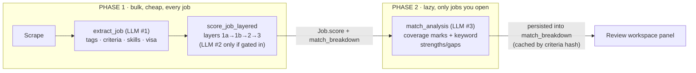
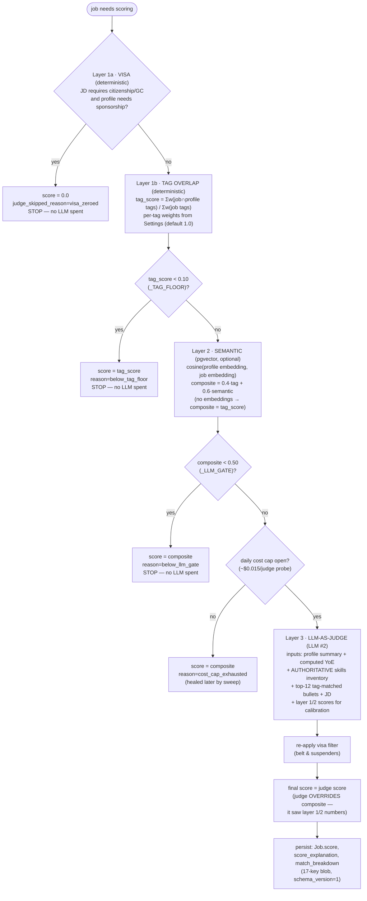
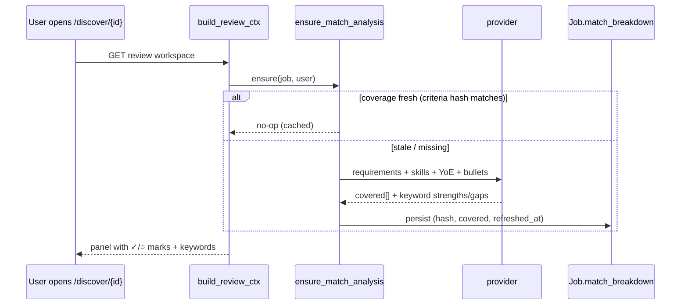

# Job Scoring & Match Analysis — End-to-End Flow

_Last updated: 2026-07 (post keyword-panel / coverage-marks / YoE rework)._

This is the canonical description of how a job goes from "scraped" to
"scored with a match panel", which LLM calls fire where, and what each
stage persists. The score itself and the review-panel presentation are
**separate concerns computed at separate times** — that split is
deliberate (see [Design rationale](#design-rationale)).

## The two-phase model

Phase 1 runs for **every** scraped job (cron-driven). Phase 2 runs
**once per job you actually open for review** — reviewed jobs are a small
fraction of scored jobs, so panel-quality analysis never taxes bulk
scoring.

## Phase 1 — the layered scorer (`services/scorer/orchestrator.py`)

Key properties:

- **Deterministic layers gate the expensive layer.** Hard disqualifiers
  (visa) and obvious non-matches (tag floor, LLM gate) cost $0. Only
  plausible matches (composite ≥ 0.50) reach the judge.
- **The judge's number IS the final score** (× `source_trust_weight`,
  currently 1.0). The composite is kept in the blob as
  `composite_pre_llm` for provenance, and is the fallback score whenever
  the judge is skipped.
- **Strengths/gaps do NOT feed the score.** They are presentation outputs
  riding along in `match_breakdown`; the number comes from `score` alone.
- Judge inputs are grounded: computed **years of experience** (merged
  experience-interval union — concurrent roles never double-count),
  the **full skills inventory marked authoritative** (no proficiency
  levels exist, so a listed skill can never be a gap), and the top-12
  bullets by tag overlap. Hallucinated bullet IDs are filtered against
  the DB before persisting.

### When Phase 1 runs (all APScheduler, Postgres job store)

| Trigger | Cadence | What it does |
| --- | --- | --- |
| `jobs.score_pending` | every 15 min | scores jobs with no `scored_at` (batch 25/user) |
| — same tick | every 15 min | `heal_judge_skipped_jobs`: retries `llm_failed` / `cost_cap` / `no_provider` jobs, ≤3 attempts each |
| `score.recompute_stale` | daily 03:30 UTC | re-scores jobs whose `scored_at` < `Profile.updated_at` (profile edits invalidate scores) |
| `score.aggregate_daily` | daily 03:35 UTC | rolls scores into `Profile.score_history` (sparklines); ALSO refreshed lazily on `/profile` read since 2026-07 |
| `embeddings.embed_pending_jobs` | nightly 02:00 UTC | embeds JDs for layer 2 (only when `semantic_match_enabled`) |

## Phase 2 — lazy match analysis (`services/scorer/match_analysis.py`)

Runs inside `build_review_ctx` the first time a scored job's review
workspace opens. One purpose-specific structured call (LLM #3):

- **Inputs:** the JD + its extracted requirement list (indexed), the
  authoritative skills inventory, titles held, computed YoE, summary,
  top bullets.
- **Outputs:** per-requirement `covered` booleans (the ✓/○ marks in WHAT
  THEY WANT) + glance-view keyword `strengths`/`gaps` (bare noun phrases,
  ≤6 words) that **overwrite** the judge's prose in `match_breakdown`.
- **Caching:** keyed by `sha256(criteria)[:16]` — recomputed only when
  the JD's requirements change (re-extraction). Failures stamp a 10-min
  cooldown so the workspace's 3s generation poll can't hammer a broken
  provider. No provider → the old token-overlap heuristic still drives
  the marks.

## Full LLM-call inventory per job lifecycle

| # | Call | When | Purpose | Skippable? |
| --- | --- | --- | --- | --- |
| 1 | `extract_job` | at scrape/ingest | JD → tags, criteria[], skills_required, salary, visa | no (heuristics fallback) |
| 2 | `score_job` (judge) | scoring cron, gated | final 0–1 score + explanation + suggested bullets | yes — visa/floor/gate/cap skip it |
| 3 | `match_analysis` | first review-open | ✓/○ coverage + keyword strengths/gaps | yes — cached, heuristic fallback |
| 4+ | generation bundle | "Tailor for this job" | select_bullets, refine×~20, tailor_summary, tailor_sections, cover letter, screeners, hiring-manager extract | user-initiated |

So a scraped job you never touch costs **1–2 calls** (extract + maybe
judge); a job you review costs **+1**; the full apply bundle is where the
real spend is, and it's always explicit.

## What lives in `Job.match_breakdown`

Provenance-first blob (17 base keys, `schema_version: 1`): the final
`score`, `tag_score`, `semantic_score`, `composite_pre_llm`,
`layers_run`, judge identity (`layer_4_provider/model`) or
`judge_skipped_reason`, `scored_at`, `matched_tags`, `per_dimension`,
`suggested_bullets`, visa flags, `strengths`/`gaps` (keyword form after
Phase 2), and `requirements_coverage {criteria_hash, covered[],
refreshed_at}`.

## Design rationale

- **Why layered instead of one big LLM call per job?** Cost and
  latency scale with scraped volume, not reviewed volume. Deterministic
  layers are free and kill the obvious cases; the judge only sees
  plausible matches; panel-quality analysis only runs for jobs a human
  opens. Each LLM call has ONE job, which keeps prompts small and
  outputs falsifiable (per-requirement booleans validate against the
  criteria list; skill items validate against the inventory).
- **Why does the judge override the composite instead of blending?**
  The judge receives the layer 1/2 numbers in its prompt and calibrates
  against them; a fixed blend would double-count the deterministic
  signal. The composite remains the honest fallback + audit trail.
- **Known limits:** layer-1b recall depends on `extract_job` tagging
  quality; the 9-tag vocabulary is coarse (title-family level); semantic
  layer is skipped entirely unless embeddings are enabled; `source_trust_weight`
  is a dormant seam (always 1.0) until per-source weighting ships.
